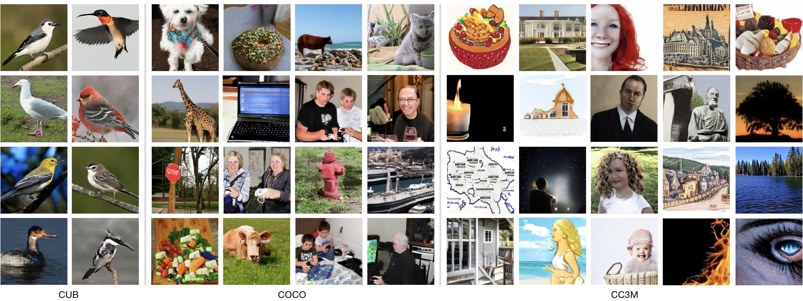

 
[](https://github.com/tobran/GALIP/blob/master/LICENSE.md)


[]((https://github.com/tobran/GALIP/graphs/commit-activity))


# GALIP: Generative Adversarial CLIPs for Text-to-Image Synthesis (CVPR 2023)

<p align="center">
    
</p>

# A high-quality, fast, and efficient text-to-image model

Official Pytorch implementation for our paper [GALIP: Generative Adversarial CLIPs for Text-to-Image Synthesis](https://arxiv.org/abs/2301.12959) by [Ming Tao](https://scholar.google.com/citations?user=5GlOlNUAAAAJ), [Bing-Kun Bao](https://scholar.google.com/citations?user=lDppvmoAAAAJ&hl=en), [Hao Tang](https://scholar.google.com/citations?user=9zJkeEMAAAAJ&hl=en), [Changsheng Xu](https://scholar.google.com/citations?user=hI9NRDkAAAAJ). 

<p align="center">
<b>Generated Images
</p>
<p align="center">
    
</p>


## Requirements
- python 3.9
- Pytorch 1.9
- At least 1x24GB 3090 GPU (for training)
- Only CPU (for sampling) 

GALIP is a small and fast generative model which can generate multiple pictures in one second even on the CPU.
## Installation

Clone this repo.
```
git clone https://github.com/tobran/GALIP
pip install -r requirements.txt
```
Install [CLIP](https://github.com/openai/CLIP)

## Preparation (Same as DF-GAN)
### Datasets
1. Download the preprocessed metadata for [birds](https://drive.google.com/file/d/1I6ybkR7L64K8hZOraEZDuHh0cCJw5OUj/view?usp=sharing) [coco](https://drive.google.com/file/d/15Fw-gErCEArOFykW3YTnLKpRcPgI_3AB/view?usp=sharing) and extract them to `data/`
2. Download the [birds](http://www.vision.caltech.edu/visipedia/CUB-200-2011.html) image data. Extract them to `data/birds/`
3. Download [coco2014](http://cocodataset.org/#download) dataset and extract the images to `data/coco/images/`

## Training
  ```
  cd GALIP/code/
  ```
### Train the GALIP model
  - For bird dataset: `bash scripts/train.sh ./cfg/bird.yml`
  - For coco dataset: `bash scripts/train.sh ./cfg/coco.yml`
### Resume training process
If your training process is interrupted unexpectedly, set **state_epoch**, **log_dir**, and **pretrained_model_path** in train.sh to resume training.

### TensorBoard
Our code supports automate FID evaluation during training, the results are stored in TensorBoard files under ./logs. You can change the test interval by changing **test_interval** in the YAML file.

  - For bird dataset: `tensorboard --logdir=./code/logs/bird/train --port 8166`
  - For coco dataset: `tensorboard --logdir=./code/logs/coco/train --port 8177`


## Evaluation

### Download Pretrained Model
- [GALIP for COCO](https://drive.google.com/file/d/1gbfwDeD7ftZmdOFxfffCjKCyYfF4ptdl/view?usp=sharing). Download and save it to `./code/saved_models/pretrained/`
- [GALIP for CC12M](https://drive.google.com/file/d/1VnONvNRjuyHTzuLKBbozZ38-WIt7XZMC/view?usp=sharing). Download and save it to `./code/saved_models/pretrained/`

### Evaluate GALIP models

  ```
  cd GALIP/code/
  ```
set **pretrained_model** in test.sh
- For bird dataset: `bash scripts/test.sh ./cfg/bird.yml`
- For COCO dataset: `bash scripts/test.sh ./cfg/coco.yml`
- For CC12M (zero-shot on COCO) dataset: `bash scripts/test.sh ./cfg/coco.yml`

### Performance
The released model achieves better performance than the paper version.


| Model            | COCO-FID↓ | COCO-CS↑   | CC12M-ZFID↓ |
| ---              | ---       | ---        | ---       |
| GALIP(paper)     | 5.85      | 0.3338     | 12.54      |
| GALIP(released)  | **5.01**  | **0.3379** | **12.54**  |


## Sampling
  
### Synthesize images from your text descriptions
  - the sample.ipynb can be used to sample

---
### Citing GALIP

If you find GALIP useful in your research, please consider citing our paper:
```

@inproceedings{tao2023galip,
  title={GALIP: Generative Adversarial CLIPs for Text-to-Image Synthesis},
  author={Tao, Ming and Bao, Bing-Kun and Tang, Hao and Xu, Changsheng},
  booktitle={Proceedings of the IEEE/CVF Conference on Computer Vision and Pattern Recognition},
  pages={14214--14223},
  year={2023}
}

```
The code is released for academic research use only. For commercial use, please contact Ming Tao (陶明) (mingtao2000@126.com).


**Reference**
- [DF-GAN: A Simple and Effective Baseline for Text-to-Image Synthesis](https://arxiv.org/abs/2008.05865) [[code]](https://github.com/tobran/DF-GAN)
